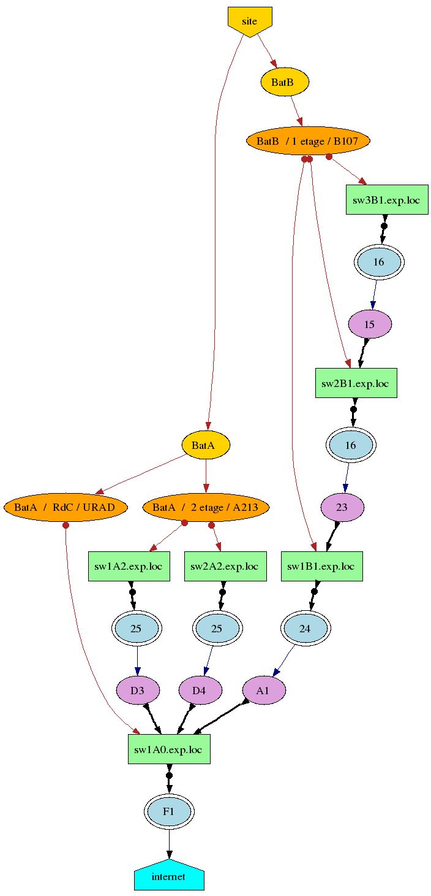

# Klask : un outil dédié à la cartographie du réseau local

The main site (forge) is https://gricad-gitlab.univ-grenoble-alpes.fr/legi/soft/trokata/klask

## Introduction

De très nombreux outils réseaux existent mais la plupart permettent de tracer des cartographies de réseau basées sur la notion de route.
Au niveau d'un réseau local commuté, cette notion de route n'apporte rien et ce genre d'outil n'est en général pas capable de structurer la carte locale des machines.
L'administrateur d'un site de taille moyenne, quelques bâtiments, une quinzaine de commutateurs, se retrouvent rapidement devant les problématiques suivantes : 

 * Où est positionnée la machine X ? Elle est à l'origine d'un problème réseau urgent à traiter, quitte à la déconnecter en désactivant le port du commutateur ;

 * Deux machines A et B de mon réseau local ne dialoguent pas. Quel est le chemin physique menant de la machine A vers la machine B ?

Rapidement, lorsque son parc machine augmente, il devient difficile de maintenir une version papier à jour de son réseau local, notamment s'il y a des mouvements de personnel...
Il est possible d'améliorer les choses en configurant le matériel actif de manière à n'associer certaines adresses physiques (MAC) de machine qu'à certains ports de commutateur.

Cependant, cela ne résout pas forcément tous les problèmes, notamment le second.

Les deux problématiques énoncées sont liées et une solution simple consiste à savoir sur quels ports des commutateurs sont connectés les machines et les matériels actifs dans un réseau local.

Des outils comme traceroute ne sont d'aucune aide sur le réseau local car l'information sur les routes ne permet pas d'en déduire les commutateurs par lequel transite les flux.
Nous avons donc développé un outil nommé Klask.
Ce mot signifie en Breton : **rechercher** et c'est exactement ce que nous voulions.
Klask est un outil dont les deux principales fonctions sont :

 * trouver les connexions entre commutateurs et de dessiner une carte du matériel actif sur le réseau local ;

 * dresser un inventaire précis du port et du commutateur sur lequel sont connectés les machines du réseau local.

**Klask** est un petit outil, dans l'esprit des outils UNIX, de ne se préoccuper que des connections sur le réseau local.
La page [MapSample](./doc/MapSample.md) a un résultat de la carte donnée par ```Klask```.
Il s'agit d'un programme qui fonctionne toujours, et qui a commencé autour de l'année 2004.
Le code est ancien, certaines parties sont plus lisibles que d'autres !

Cependant, Klask fonctionne sur un réseau comportant plusieurs classe réseau et plusieurs VLAN.
Pour configurer Klask, consulter la page [MultiVlan](./doc/MultiVlan.md).

Il existe une documentation en ligne extraite du code source de [klask](https://legi.gricad-pages.univ-grenoble-alpes.fr/soft/trokata/klask/).

## Interfaces Web

Il existe maintenant deux interfaces Web pour Klask. 

 * une première interface est intégrée dans la branche principale.
   Il s'agit d'une interface très simple permettant de faire une page web statique utilisant un peu (le minimum) de javascript pour trier dynamiquement les tableaux.
   Le script ```Bash``` est ```/usr/lib/klask/push-web``` et il se configure via le fichier ```/etc/klask/push-web.conf```.
   L'ojectif de ce script est de créer les pages web statiques puis de les pousser sur un site distant.
   Le site distant doit avoir les commandes ```rsync``` pour la copie des fichiers et ```dot``` (paquetage [graphivz](http://www.graphviz.org/)) pour la création des graphes ;

 * une seconde interface a été écrite à Lyon en PHP.
   Cette interface est un projet à part entière, elle a donc sa propre page [WebKlask](https://gricad-gitlab.univ-grenoble-alpes.fr/legi/soft/trokata/klask-webphp) !
   Elle n'est plus maintenue depuis des années.

## Téléchargement et Installation

On des paquetages pour Debian sur la page [download](https://legi.gricad-pages.univ-grenoble-alpes.fr/soft/trokata/klask/download/).

## Auteur et Licence

Klask a été conçu et développé par Gabriel Moreau.
Il y a de nombreuses choses à améliorer qui sont prévus...
Celle-ci seront faites au fur et à mesure du temps disponible et de l'urgence des demandes !

Klask est développé en Perl.
Il est publié sous la même licence libre que Perl ; la **Perl Artistic License**.
Pour avoir une liste des licences libres, voir http://www.gnu.org/licenses/license-list.fr.html et http://fr.wikipedia.org/wiki/Licence_libre


## Cartographie des commutateurs

### Base de données des commutateurs

On ne s'intéresse qu'aux commutateurs ethernet  administrables par SNMP qui seront simplement appelés par la suite commutateur.
Les autres commutateurs, ne pouvant être interrogés, ne seront pas pris en compte dans notre cartographie.
Il existe aujourd'hui des équipements réseaux n'ayant qu'une interface d'administration web.
Ceux-ci seront peut-être pris en charge dans Klask dans une future version selon les possibilités de ceux-ci.

La liste des matériels actifs administrables doit être donnée dans le fichier de configuration global.
Selon le modèle du commutateur, on spécifie dans ce fichier la version du protocole SNMP à utiliser, les paramètres SNMP ainsi que sa position physique  (bâtiment, numéro de bureau).
Ces données peuvent être globales et/ou surchargées par commutateur (par exemple le paramètre community de SNMP) ou bien peuvent-être écrites dans sa configuration interne lorsque cela est possible (par exemple la position géographique du commutateur).

La commande updatesw met à jour la base de données des interconnexions entre commutateurs.

```bash
klask updatesw
```

En pratique, Klask commence par rechercher l'ensemble des adresse physiques (MAC) des équipements réseaux puis il interroge chaque commutateur afin de connaître sur quels ports de celui-ci sont détectés les autres commutateurs.
Enfin un algorithme du type du plus court chemin donne la position respective des différents commutateurs entre-eux.

En précisant dans le fichier de configuration les adresses IP des routeurs, Klask ajoute à cette description des commutateurs les ports de sortie vers ceux-ci.

### Interconnexion des commutateurs

La commande exportsw affiche le contenu de la base de données des commutateurs sous le format que l'on choisit.

```bash
klask exportsw [-f format]
```

Par défaut, le format est txt, mais il est aussi implémenté le format dot qui permet de réaliser ensuite une vue graphique du réseau.

Le tableau suivant donne les ports d'interconnexion entre les équipements réseaux ainsi que le sens de la connexion sur un réseau fictif (domaine exp.loc).
Chaque flêche indique la direction vers la sortie du réseau, en pratique le routeur d'entrée de site.
Par exemple, ce tableau montre que le commutateur sw2A2 est connecté via son port 25 sur le port D4 du commutateur sw1A0, ce dernier étant lié au routeur via son port F1.

```
 Switch inter-connection
 -------------------------------------
 sw1A0.exp.loc A1 <--+ 24 sw1B1.exp.loc
 sw1A0.exp.loc D3 <--+ 25 sw1A2.exp.loc
 sw1A0.exp.loc D4 <--+ 25 sw2A2.exp.loc
 sw1A0.exp.loc F1 +--> router
 sw1A2.exp.loc 25 +--> D3 sw1A0.exp.loc
 sw2A2.exp.loc 25 +--> D4 sw1A0.exp.loc
 sw1B1.exp.loc 23 <--+ 16 sw2B1.exp.loc
 sw1B1.exp.loc 24 +--> A1 sw1A0.exp.loc
 sw2B1.exp.loc 15 <--+ 16 sw3B1.exp.loc
 sw2B1.exp.loc 16 +--> 23 sw1B1.exp.loc
 sw3B1.exp.loc 16 +--> 15 sw2B1.exp.loc
Graphe des commutateurs
```

Le tableau des interconnexions est bien pratique et peut facilement être envoyé par courriel à un collègue mais il ne permet pas d'avoir une vue d'ensemble en quelques secondes.
En demandant à Klask une sortie au format dot et avec le programme GraphViz, il est possible de générer une carte graphique représentant visuellement ces informations. 

```bash
klask exportsw -f dot > map.dot
dot -Tpng map.dot > map.png
```

La figure 1 représente le résultat sur ce cas assez simple. La figure est coupée en deux, la partie haute dans les teintes rouge et jaune est une schématisation du site avec ses bâtiments.
La partie inférieur représente les connexions entre commutateurs avec le point de sortie vers internet en bas du graphe.
Chaque commutateur de couleur verte est dans un local technique, le port de sortie de celui-ci est de couleur bleu.
Les ports d'un commutateur sur lequel sont branchés d'autres matériels actifs sont en violet.



Figure 1 - Carte des commutateurs


### Analyse du graphe

Dans ce cas de figure, le graphe est vertical car il est petit mais c'est exceptionnel, la tendance est d'obtenir des graphes larges et peu hauts.

Il est assez facile de faire sur ce cas une critique de la configuration réseau.
En effet, on remarque au bâtiment B trois commutateurs cascadés les uns derrières les autres alors que le commutateur `sw3B1` aurait été plus judicieusement placé directement derrière `sw1B1`.
Il n'est pas possible cependant de connecter tous les commutateurs du bâtiment B sur le commutateur d'entrée de site comme cela est réalisé pour le bâtiment A pour une raison de coût ; les bâtiments étant généralement interconnectés en fibre optique et le nombre de fibres étant limité.


Figure 2 - Optimisation de la carte

La figure 2 est le résultat de l'analyse faite avec Klask après avoir physiquement fait ce changement de connexion sur les équipements réseaux du bâtiment B.
