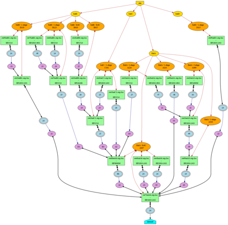

# Exemple de carte

La carte ici en exemple est une vraie carte.
Elle correspond a celle que nous avons eu sur le site a une certaine époque...
Bien entendus, les noms des commutateurs, les ports, les bâtiments ont été modifié mais la forme de la carte a existé un jour telle quelle.



Cette carte a été obtenu depuis le fichier source (format ```dot``` - ```graphviz```)
via les commandes :

```bash
dot -T png switch-map.txt >  switch-map.png 
convert -geometry 450x switch-map.png switch-map-mini.png 
```
